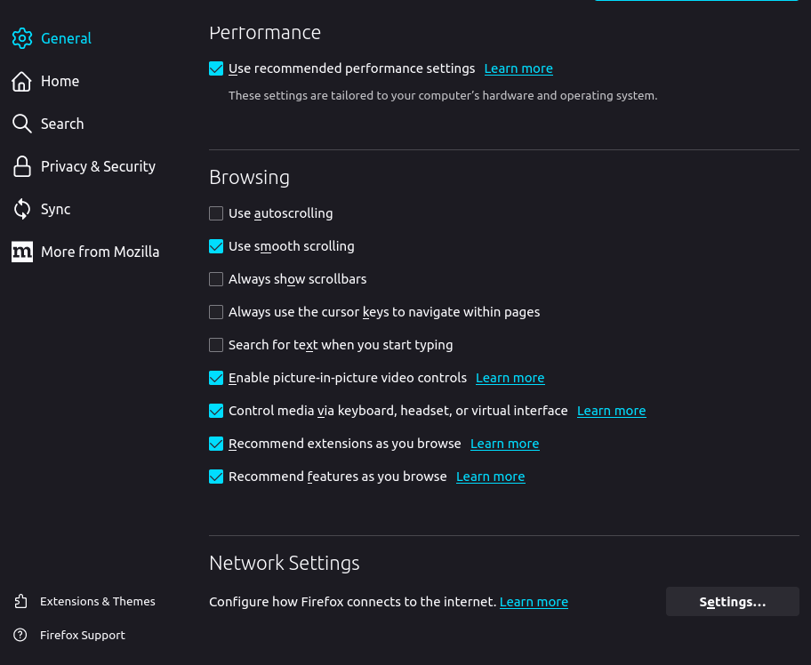
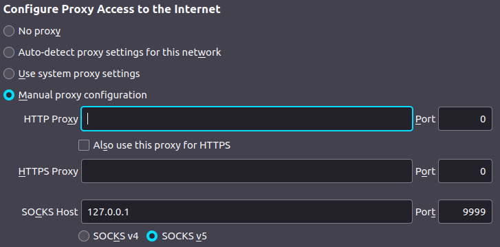

# Python_proxy_server
SOCKS5 proxy server written in python 3

## Overview
This is a simple SOCKS5 proxy server written in pure python 3 and sockets library  
This application works with HTTP/HTTPS websites

## Usage
1. Clone this repository: `git clone https://github.com/ILoveNetworking/python_proxy_server.git` or download binary from releases
2. If you cloned a repository, go inside the folder: `cd python_proxy_server`
3. To run script you can use this command: `python3 ./Proxy.py`
4. Or alternatively you can compile to standalone binary with: `chmod +x compile.sh` and then: `./compile.sh`
5. Then run produced binary: `./socks5proxy`

### Browser setup
Here is an example how to use this SOCKS5 Proxy server within a Firefox browser  
1. Open your Forefox browser
2. Go to Settings -> General -> List to the end of the page -> Network settings  

3. Press settings button and set SOCKS5 proxy as shown in the image, except IP address will be address of the server where you deployed this proxy application  

4. All done now, enjoy!
